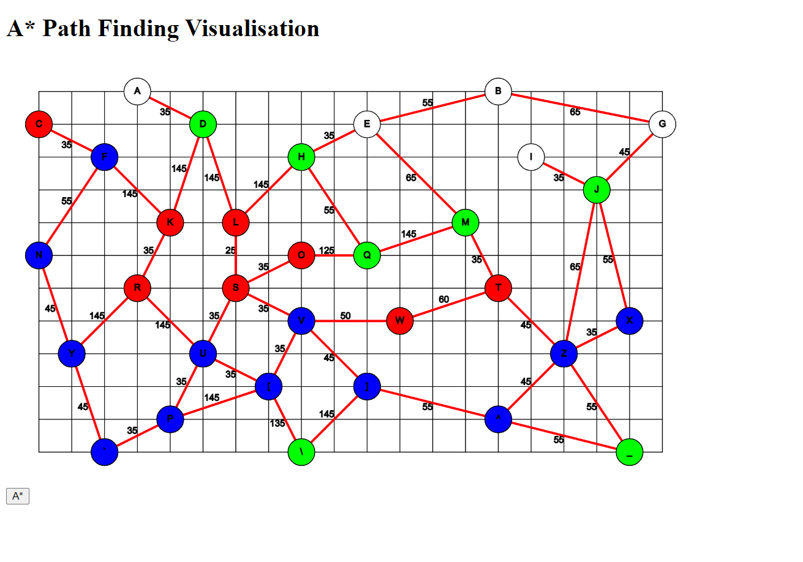
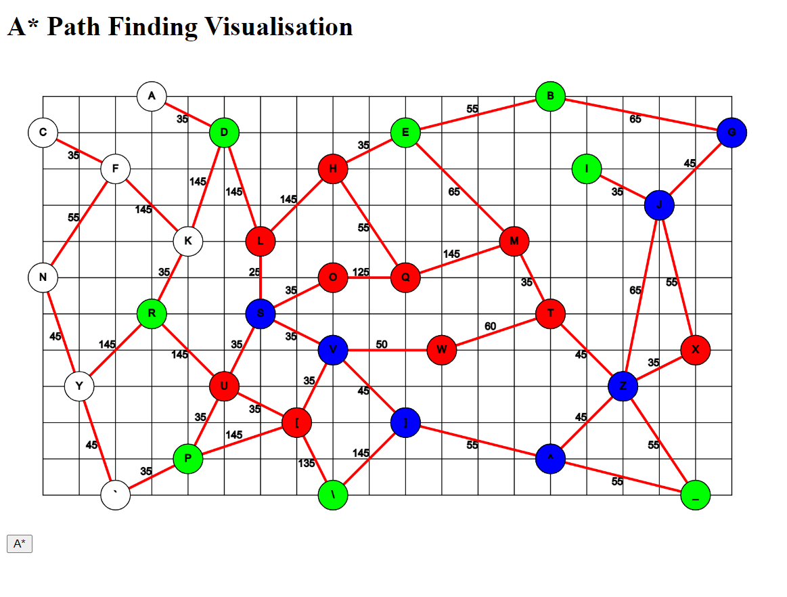

# Path Finding
1. Click on Intersections to add vertex.
2. Drag from one vertex to another to create edges between them.
3. After each edge is creted, enter G value for the said edge.
4. Click `A*` and enter the start and end vertex name.

Path from F to X

Path from S to G
